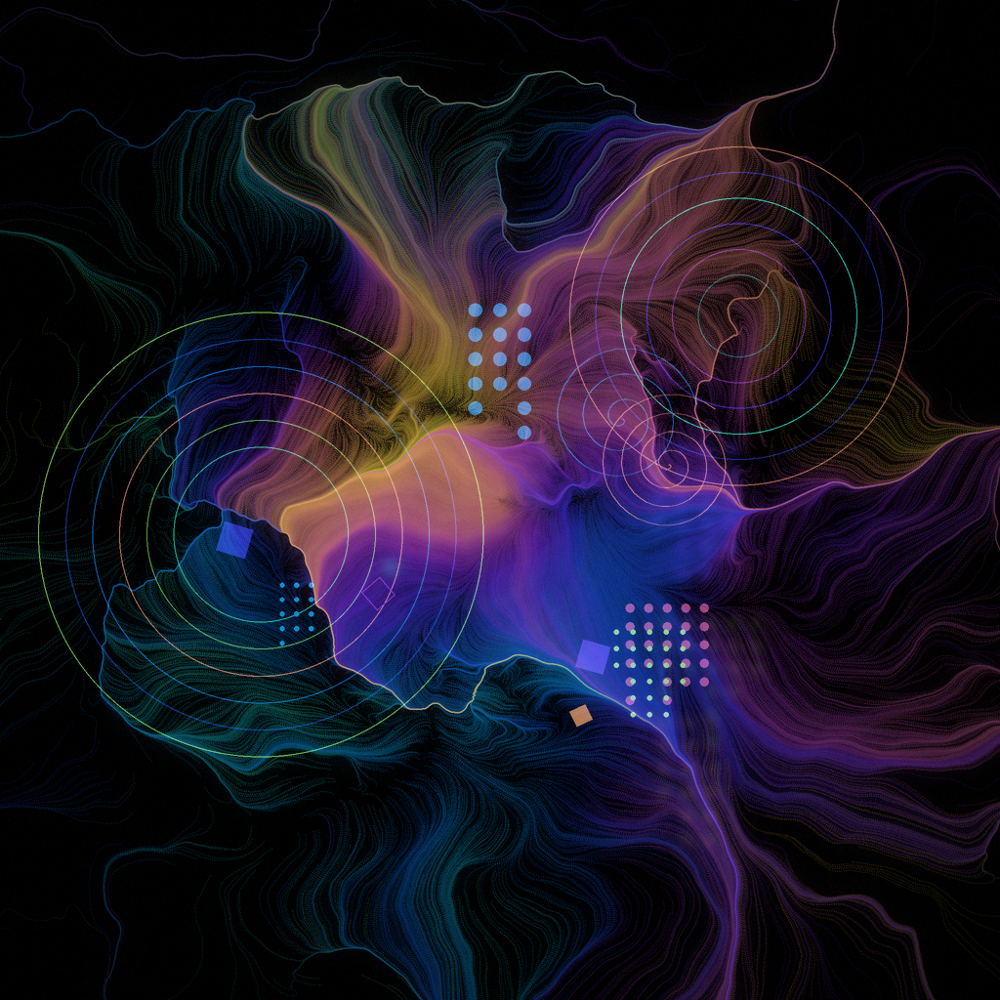
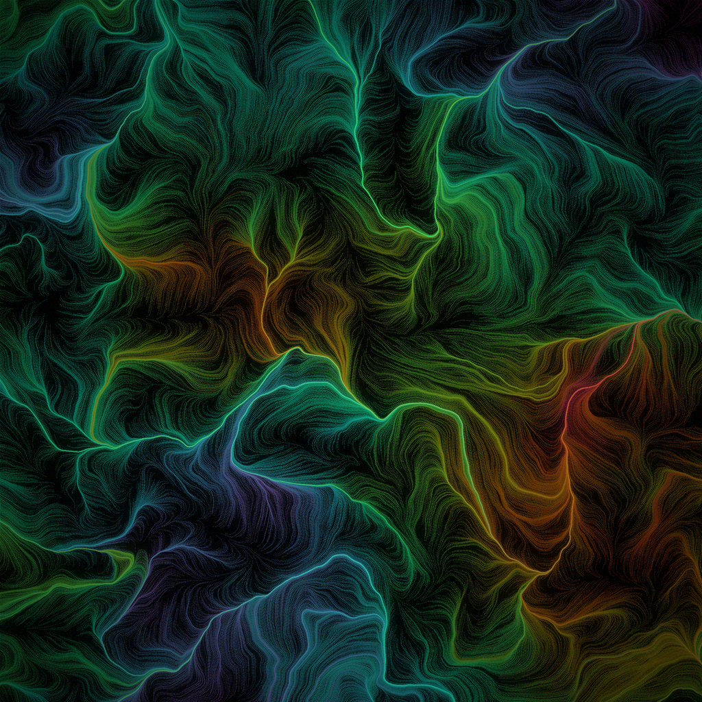
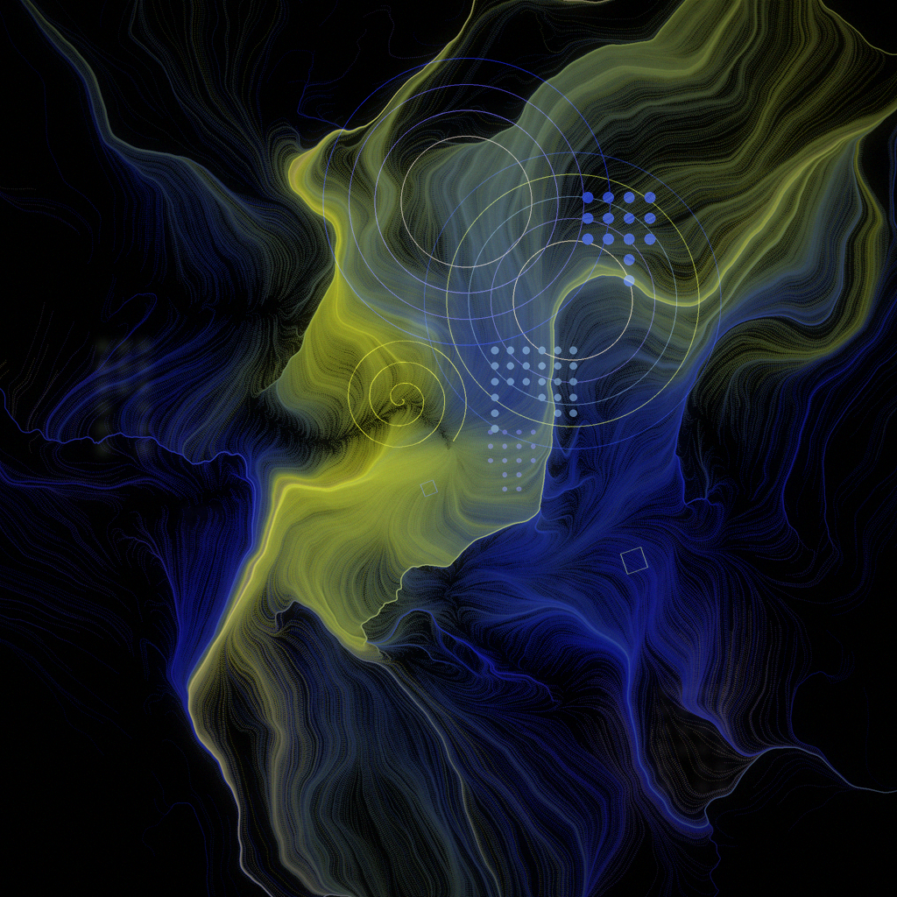

# fractal-of-the-day

A free, CPU-only, **deterministic-per-date** generative-art engine. Each calendar day
seeds one image — same date always yields the same art — built to approach the look of
art-directed abstract diffusion pieces, but from pure code: no GPU, no model in the core
path, fully reproducible.

<p align="center">
  
  
  
</p>

## How it works

The drama comes from layering a few well-understood techniques, not from a fractal alone:

- **Flow fields + domain warping** — particles advect through a domain-warped value-noise
  field (Inigo Quilez warping + Tyler Hobbs flow fields), drawn as glowing ribbons with
  additive accumulation and log-density tone mapping. This is the "designed chaos" engine.
- **Cosine palettes** (Quilez) and **palettes sampled from a reference image** (k-means,
  HSV-boosted) — deterministic, harmonious colour.
- **Two styles**, chosen by the date seed: `marble` (edge-to-edge flow) and `focal`
  (radial explosion with negative space).
- **Discrete-element overlay** — rings, halftone dot clusters, diamonds and spirals,
  composited in dim/blurred *back* and crisp *front* depth layers.
- **Generate-N-pick-best** — render N cheap preview candidates, score them, re-render the
  winner at full quality. Scorer is pluggable: a free heuristic by default, or an opt-in
  LAION CLIP+MLP aesthetic model.

See [`FINDINGS.md`](FINDINGS.md) for the research, citations, measured trade-offs and the
full roadmap.

## Usage

```bash
uv venv && uv pip install -r requirements.txt

# today's image
python daily.py

# a specific date, 12 candidates
python daily.py 2026-01-01 12

# use the learned aesthetic scorer (needs the optional deps below)
python daily.py 2026-01-01 12 --aesthetic
```

Output is written to `day_<YYYYMMDD>.png`.

### Optional: learned aesthetic scorer

```bash
uv pip install -r requirements-aesthetic.txt   # torch + transformers + CLIP aesthetic
```

Enables `--aesthetic`: a LAION CLIP+MLP predictor that judges candidate "taste" better
than the heuristic (it disagrees with — and beats — the heuristic on real samples). Costs a
one-time ~1.7 GB model download and ~0.5–2 s/candidate on CPU; the pipeline falls back to
the heuristic automatically if the deps are absent.

### Reference palettes

Drop any image as `reference.png` to let the `reference` palette source sample its colours.
Without it, the engine uses cosine palettes (graceful fallback). The reference image is
**not** committed.

## Layout

```
daily.py                 the engine (styles, palettes, scorer, overlay, orchestration)
FINDINGS.md              research synthesis + decisions + roadmap
gallery/                 curated sample outputs
evolution/               earlier prototypes (flame/Julia/Newton, then the v2 flow core)
requirements*.txt        core deps; optional learned-scorer deps
```

## Credits

Technique sources: [Inigo Quilez](https://iquilezles.org) (domain warping, cosine
palettes), [Tyler Hobbs](https://www.tylerxhobbs.com) (flow fields, colour in generative
art), the [flam3](https://github.com/scottdraves/flam3) fractal-flame renderer, and the
[LAION aesthetic predictor](https://github.com/christophschuhmann/improved-aesthetic-predictor).
